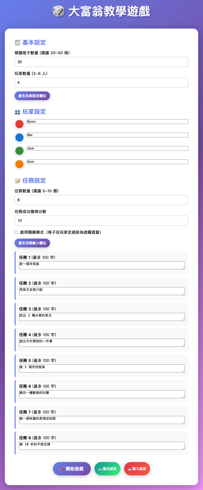
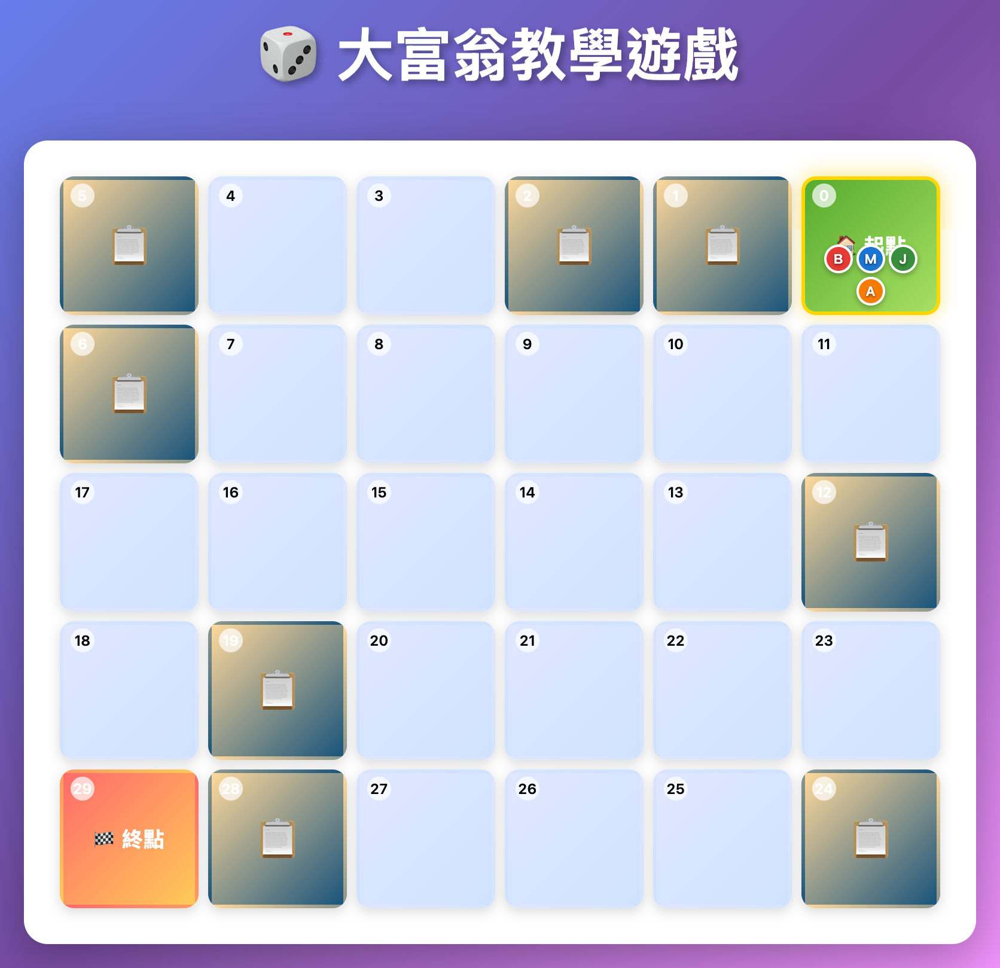
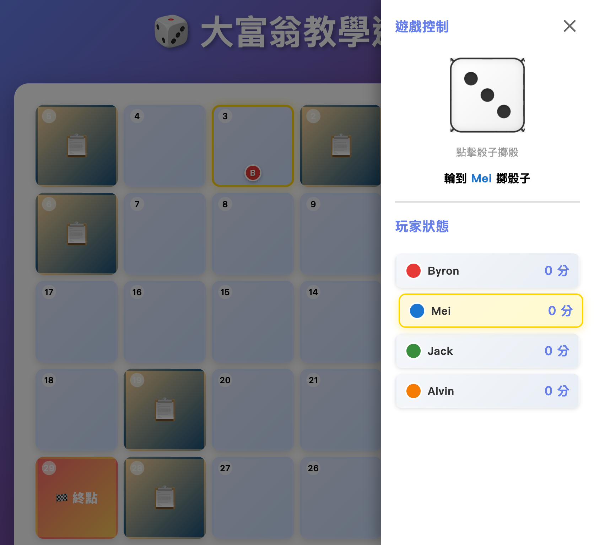
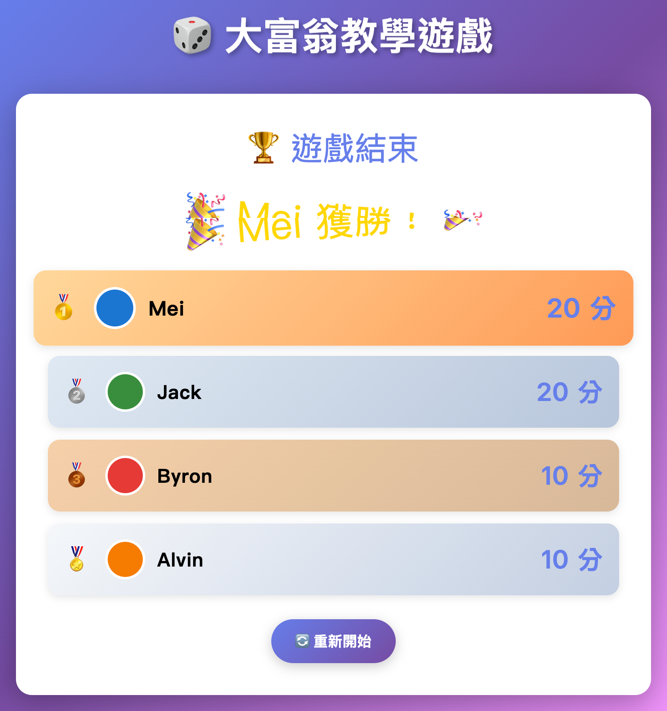

# 🎲 大富翁教學遊戲

一款專為課堂教學設計的互動式大富翁遊戲，讓學生透過遊戲完成真實任務，寓教於樂！


## ✨ 特色功能

- 🎯 **真實任務系統** - 不只是遊戲，讓學生完成實際的學習任務
- 🎨 **精美 3D 骰子** - 真實的骰子滾動動畫，增加遊戲趣味性
- 🌈 **30 種玩家顏色** - 支援多人遊戲，每位玩家都有獨特色彩
- 🗺️ **蛇形棋盤** - 獨特的蛇形路徑設計，增加遊戲策略性
- 🎭 **迷霧模式** - 隱藏未探索的格子，增加探索樂趣
- 📱 **響應式設計** - 支援桌面、平板、手機，隨處可玩
- 💾 **設定匯入/匯出** - 輕鬆分享遊戲設定，重複使用
- 🎓 **零程式碼設定** - 老師不需要寫程式，透過介面即可設定

## 🎮 遊戲展示

### 遊戲設定頁面
- 自訂棋盤格子數量 (20-50 格)
- 設定玩家數量與名稱 (2-6 人)
- 自訂任務內容與分數
- 選擇是否啟用迷霧模式



### 遊戲進行畫面
- 彩色蛇形棋盤
- 3D 骰子動畫
- 即時分數顯示
- 玩家位置追蹤





### 任務系統
- 隨機任務分配
- 任務完成判定
- 即時計分



## 🚀 快速開始

### 線上使用

1. 下載 `index.html` 檔案
2. 用瀏覽器開啟檔案（支援 Chrome、Firefox、Safari、Edge）
3. 開始設定您的遊戲！

### 本地使用

```bash
# 下載專案
git clone https://github.com/你的帳號/大富翁教學遊戲.git

# 進入資料夾
cd game

# 用瀏覽器開啟
open index.html  # macOS
start index.html # Windows
```

**就這麼簡單！不需要安裝任何套件或伺服器。**

## 📚 使用說明

### 1️⃣ 遊戲設定

#### 基本設定
- **棋盤格子數量**：建議 20-50 格（格子越多遊戲越長）
- **玩家數量**：2-6 人
- **玩家名稱與顏色**：點擊玩家顏色圓圈可選擇 30 種顏色

#### 任務設定
- **任務數量**：建議 5-15 個
- **任務成功分數**：每個任務完成可得幾分
- **任務內容**：輸入您想讓學生完成的任務（最多 100 字）
- **隱藏模式**：勾選後，格子在玩家走過前會顯示迷霧

#### 預設任務範例
遊戲提供 25 個預設任務範例，包括：
- 唱一首歌給大家聽
- 做 10 個深蹲
- 說出 5 個英文單字
- 背誦九九乘法表其中一段
- 更多...

### 2️⃣ 遊戲進行

1. **點擊右下角骰子按鈕** 打開遊戲控制面板
2. **點擊骰子** 擲骰子
3. **玩家自動移動** 到目標格子
4. **完成任務**（如果停在任務格）
   - 彈出任務視窗
   - 學生完成任務
   - 老師判定完成/失敗
5. **輪到下一位玩家**
6. **到達終點** 遊戲結束，顯示計分板

### 3️⃣ 匯入/匯出設定

#### 匯出設定
1. 設定好遊戲參數與任務
2. 點擊「📤 匯出設定」
3. 下載 JSON 設定檔
4. 分享給其他老師使用

#### 匯入設定
1. 點擊「📥 匯入設定」
2. 選擇之前匯出的 JSON 檔案
3. 自動填入所有設定
4. 開始遊戲！

## 🎓 教學應用場景

### 適用科目與範例

#### 🏃 體育課
```
任務範例：
- 做 20 個開合跳
- 平板支撐 30 秒
- 跳繩 50 下
- 仰臥起坐 15 個
```

#### 🔤 英文課
```
任務範例：
- 說出 5 種動物的英文
- 背誦一段英文對話
- 用英文自我介紹
- 拼出 3 個英文單字
```

#### 🔢 數學課
```
任務範例：
- 背誦九九乘法表其中一段
- 回答數學問題：12 × 8 = ?
- 說出圓周率前 5 位
- 計算 25 + 37 = ?
```

#### 🎵 音樂課
```
任務範例：
- 唱一首歌給大家聽
- 拍出節奏 ♩♩♫♩
- 說出 3 種樂器名稱
- 模仿一種樂器聲音
```

#### 🌍 社會課
```
任務範例：
- 說出 5 個國家名稱
- 講出台灣的 3 個縣市
- 分享一個歷史小故事
- 說明一個節日的由來
```

#### 🎨 綜合活動
```
任務範例：
- 說一個冷笑話
- 做一個有趣的表情
- 跟大家分享一個夢想
- 表演一個魔術
```

### 教學優勢

✅ **提升學習動機** - 遊戲化學習讓學生更投入
✅ **公平競爭機制** - 骰子隨機性確保公平
✅ **即時回饋** - 任務完成立即得分，增強成就感
✅ **適合分組活動** - 2-6 人遊戲，培養團隊精神
✅ **彈性調整** - 老師可依程度調整任務難度
✅ **重複使用** - 設定可匯出分享，節省備課時間

## 💡 使用技巧

### 課前準備
1. **設計任務內容**：根據教學目標設計 8-15 個任務
2. **測試可行性**：確保所有任務在課堂時間內可完成
3. **匯出設定**：儲存設定檔備份，避免重複設定
4. **準備投影**：將遊戲投影到大螢幕

### 課堂執行
1. **說明規則**：向學生解釋遊戲規則與任務
2. **輪流操作**：學生輪流操作電腦/平板
3. **老師當裁判**：判定任務是否完成
4. **鼓勵參與**：即使失敗也給予鼓勵

### 課後延伸
1. **檢討分享**：討論哪些任務最有趣/最困難
2. **學生設計**：讓學生自己設計任務內容
3. **分享設定**：將設定檔分享給其他老師

## 🛠️ 技術規格

### 使用技術
- **HTML5** - 頁面結構
- **CSS3** - 樣式與動畫（含 3D Transform）
- **Vanilla JavaScript** - 遊戲邏輯（無需框架）

### 瀏覽器支援
- ✅ Chrome 90+
- ✅ Firefox 88+
- ✅ Safari 14+
- ✅ Edge 90+

### 裝置支援
- 💻 桌上型電腦
- 💻 筆記型電腦
- 📱 平板電腦
- 📱 智慧型手機

### 檔案大小
- 單一 HTML 檔案：約 47 KB
- 無需網路連線
- 無外部資源依賴

## 🎯 核心功能

### 遊戲機制
- [x] 蛇形棋盤佈局
- [x] 3D 骰子動畫
- [x] 玩家移動動畫
- [x] 任務隨機分配
- [x] 任務完成判定
- [x] 即時計分系統
- [x] 遊戲結束結算

### 進階功能
- [x] 迷霧模式（隱藏未探索格子）
- [x] 30 種玩家顏色
- [x] 設定匯入/匯出
- [x] LocalStorage 持久化
- [x] 響應式設計
- [x] 自動視角追蹤
- [x] 玩家狀態即時顯示

### 使用者體驗
- [x] 直覺的操作介面
- [x] 流暢的動畫效果
- [x] 清晰的視覺回饋
- [x] 行動裝置優化

## 📖 詳細文件

- [專案結案報告](./PROJECT_REPORT.md) - 完整的技術文件與開發紀錄

## 🤝 貢獻指南

歡迎提出建議或貢獻程式碼！

### 如何貢獻
1. Fork 此專案
2. 建立您的功能分支 (`git checkout -b feature/AmazingFeature`)
3. 提交您的變更 (`git commit -m 'Add some AmazingFeature'`)
4. 推送到分支 (`git push origin feature/AmazingFeature`)
5. 開啟 Pull Request

### 建議功能
- 🔊 音效系統
- 🎁 道具系統
- 🏆 成就系統
- 🌐 多人線上對戰
- 📊 遊戲數據分析
- 🎨 自訂主題顏色

## ❓ 常見問題

### Q: 需要安裝什麼軟體嗎？
A: 不需要！只要有現代瀏覽器（Chrome、Firefox、Safari、Edge）即可。

### Q: 可以離線使用嗎？
A: 可以！下載 `index.html` 後不需網路連線即可使用。

### Q: 可以修改任務內容嗎？
A: 當然！所有任務都可以自訂，每個任務最多 100 字。

### Q: 支援多少人遊戲？
A: 支援 2-6 位玩家同時遊玩。

### Q: 如何分享我的遊戲設定？
A: 使用「匯出設定」功能，會產生一個 JSON 檔案，分享給其他人後可用「匯入設定」載入。

### Q: 手機上可以玩嗎？
A: 可以！遊戲支援響應式設計，在手機、平板、電腦上都能流暢運行。

### Q: 迷霧模式是什麼？
A: 啟用後，玩家未走過的格子會被迷霧遮蓋，增加探索的驚喜感。

### Q: 可以用在商業用途嗎？
A: 可以！本專案採用 MIT 授權，可自由使用、修改、分發。

## 📧 聯絡資訊

- 🐛 回報問題：[GitHub Issues](https://github.com/apan1121/monopoly-edu/issues)
- 💡 功能建議：[GitHub Discussions](https://github.com/apan1121/monopoly-edu/discussions)
- 📧 Email：apan1121@gmail.com

## 🌟 Star History

如果這個專案對您有幫助，請給我們一個 ⭐️ Star！

## 🎉 致謝

感謝所有使用本遊戲的老師與學生，您們的回饋讓這個專案更加完善！

---

**用遊戲讓學習更有趣！🎲✨**

Made with ❤️ for Education
